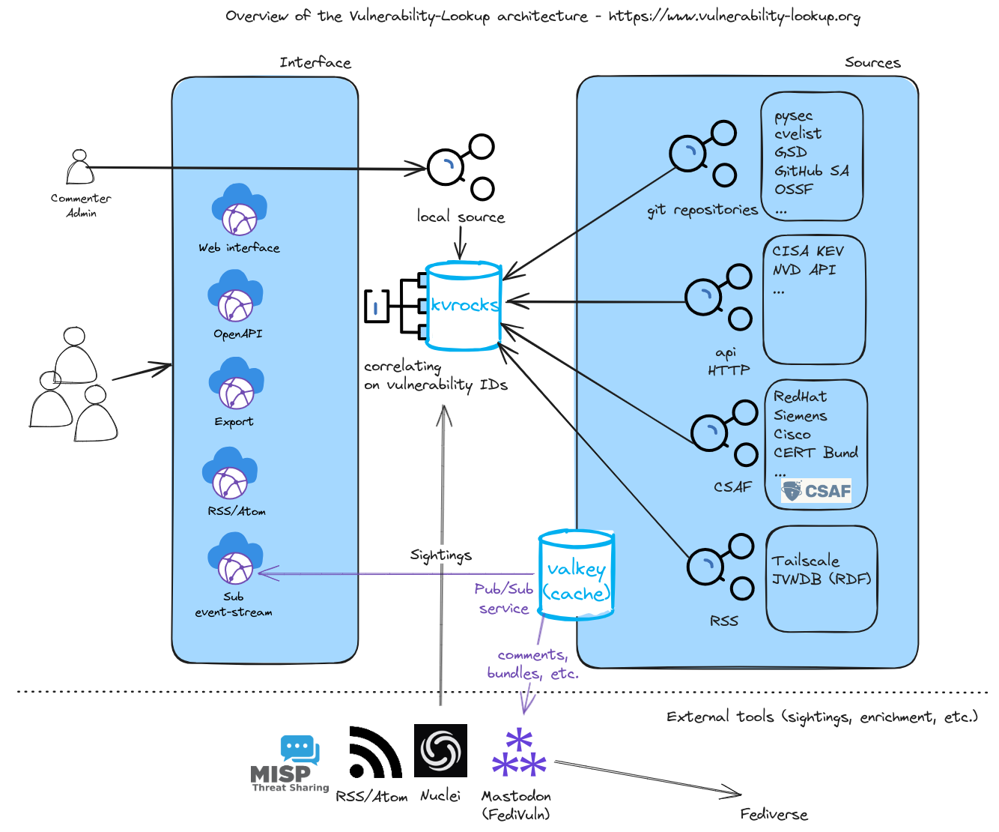

# Vulnerability Lookup

Vulnerability Lookup facilitates quick correlation of vulnerabilities from various sources,
independent of vulnerability IDs, and streamlines the management of Coordinated Vulnerability Disclosure (CVD).
Vulnerability Lookup is also a collaborative platform where users can comment on security advisories and create bundles.

A Vulnerability Lookup instance operated by [CIRCL](https://www.circl.lu)
is available at [https://vulnerability.circl.lu](https://vulnerability.circl.lu).

## Features

- **API**: A comprehensive and fast lookup API for searching vulnerabilities and identifying correlations by vulnerability identifier.
- **Feeders**: Modular system to import vulnerabilities from different sources.
- **CVD process**: Creation, edition and fork/copy of Security Advisories with the [vulnogram editor](https://github.com/Vulnogram).
  Support of local vulnerability source per Vulnerability Lookup instance.
- **Sightings**: Users have the possibility to add observations to vulnerabilities with different types of sightings, such as:
  *seen*, *exploited*, *not exploited*, *confirmed*, *not confirmed*, *patched*, and *not patched*.
- **Comments**: Ability to add, review and share comments on vulnerability advisories.
- **Bundles**: Possibility to create bundles of vulnerability advisories with a description.
- **RSS/Atom**: An extensive RSS and Atom support for vulnerabilities and comments.
- **EPSS**: Integration of the Exploit Prediction Scoring System score.

A documentation is available [here](https://vulnerability.circl.lu/documentation).

## Sources and Feeders

- [CISA Known](https://www.cisa.gov/known-exploited-vulnerabilities-catalog) exploited vulnerability DB (via HTTP).
- NIST NVD CVE importer (via API 2.0).
- [CVEProject - cvelist](https://github.com/CVEProject/cvelist) (via git submodule repository).
- Cloud Security Alliance - [GSD-Database](https://github.com/cloudsecurityalliance/gsd-database/) (via git submodule repository).
- GitHub [Advisory Database](https://github.com/github/advisory-database) (via git submodule repository).
- PySec [Advisory Database](https://github.com/pypa/advisory-database) (via git submodule repository).
- [OpenSSF Malicious Packages](https://github.com/ossf/malicious-packages) (via git submodule repository)
- Additional sources via CSAF including CERT-Bund, CISA, Cisco, nozominetworks, Open-Xchange, Red Hat, Sick, Siemens.
- [VARIoT](https://www.variotdbs.pl/vulns/) IoT vulnerabilities database.
- [JVN iPedia](https://jvndb.jvn.jp), Japan database of vulnerability countermeasure information.
- [Tailscale](https://tailscale.com/security-bulletins) security bulletins.

## Sighting Sources

Vulnerability-lookup supports the ability to record sightings of vulnerabilities (whether published or unpublished by a source), and a series of sighting clients already exist:

- Fediverse - [A sighting client to gather vulnerability-related information from the Fediverse](https://pypi.org/project/FediVuln)
- MISP - [A sighting client that retrieves vulnerability observations from a MISP server and pushes them to a Vulnerability Lookup instance](https://pypi.org/project/VulnerabilityLookupSighting)
- Nuclei - [A sighting client designed to retrieve vulnerability-related information from the Nuclei Git repository of templates.](https://pypi.org/project/NucleiVuln)
- Exploit-DB - [A client that retrieves vulnerability observations from Exploit-DB and pushes them to a Vulnerability-Lookup instance](https://pypi.org/project/ExploitDBSighting)
- [Known Exploited Vulnerabilities (KEV) catalog](https://pypi.org/project/kevsight)

## Installation

### Requirements

- Recent version of Python 3.10
- Recent version of Poetry
- [Kvrocks database](https://github.com/apache/kvrocks)

[Installation instructions](https://vulnerability.circl.lu/documentation/installation.html) are available in the documentation.

## Why Vulnerability Lookup ?

Vulnerability Lookup is a rewritten version of cve-search, an open-source tool initially aimed at maintaining a local CVE database.
The original cve-search had design and scalability limitations, and its public instance operated by CIRCL is maxing out at 20,000 queries per second.

As vulnerability sources have diversified beyond the NVD CVE, a new tool was needed to support the CVD process,
allowing for bundling, commenting, publishing, and extending vulnerability information in a collaborative manner.

## Architecture

## License

vulnerability-lookup is free software released under the "GNU Affero General Public License v3.0".

~~~
Copyright (c) 2023-2024 Computer Incident Response Center Luxembourg (CIRCL)
Copyright (c) 2023-2024 Alexandre Dulaunoy - https://github.com/adulau
Copyright (c) 2023-2024 Raphaël Vinot - https://github.com/Rafiot
Copyright (c) 2024 Cédric Bonhomme - https://github.com/cedricbonhomme
~~~
