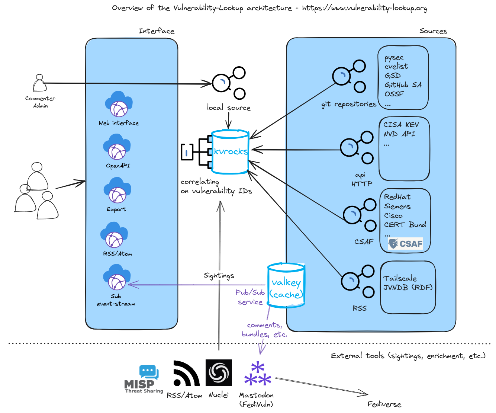

High level architecture
=======================

   High level architecture

Backend
-------

The backend consists of multiple feeders responsible for downloading security advisories from various sources.
Everything is collected in a Kvrocks database.

An internal Pub/Sub service is available, enabling each feeder to publish the collected data to the event stream.
This allows for seamless integration with services like:

- Apache Solr, for example, to index all JSON files efficiently
- email notification system

It is also possible to activate an authenticated HTTP event-stream subscribe service.

Interface
---------

Tools
-----

It is possible to extend Vulnerability-Lookup functionalities thanks to its API and various tools.
For example to facilitate the provision of :ref:`Sightings`.
